# Smart Daily Expense Tracker

A comprehensive expense tracking application built with modern Android development practices, designed specifically for small business owners to digitize their daily expense management.

## ⬇️ Download APK

Direct link: https://drive.google.com/file/d/1eYI5cNwrFekCyIKOZRS8V-sMLkcfArc-/view?usp=sharing

## 📦 Submission Deliverables

This repository includes all the required submission artifacts in the project root:

- **Name**: see `NAME.txt`
- **App Overview**: see the sections below (2–3 lines at the top of this README)
- **AI Usage Summary**: see the "AI Usage Summary" section below (3–5 lines)
- **Prompt Logs**: `PROMPT_LOGS.md`
- **Checklist of Features Implemented**: `FEATURES_CHECKLIST.md`
- **APK Download Link**: `docs/APK_LINK.md` (update with your public link)
- **Screenshots**: `docs/screenshots/` folder
- **Resume**: add `resume.pdf` in the root (a placeholder `resume.txt` is provided)
- **Full Source Code**: this repository (Jetpack Compose UI, MVVM, clean & modular)

Update the placeholders with your actual content before submitting.

## 🏗️ Architecture

This app follows **Clean Architecture** principles with **MVVM** pattern:

- **Data Layer**: Room database, Repository pattern
- **Domain Layer**: Use cases, Business logic
- **Presentation Layer**: Jetpack Compose UI, ViewModels

## 🛠️ Tech Stack

- **Language**: Kotlin
- **UI Framework**: Jetpack Compose with Material 3
- **Architecture**: Clean Architecture + MVVM
- **Dependency Injection**: Hilt (Dagger)
- **Database**: Room
- **Navigation**: Navigation Compose
- **State Management**: StateFlow & Compose State
- **Charts**: Custom Canvas-based charts
- **Animations**: Compose Animations

## ✨ Features

### Core Features
- **Expense Entry Screen**: Add expenses with title, amount, category, notes, and optional receipt
- **Expense List Screen**: View expenses with filtering by date and category, grouping options
- **Reports Screen**: Visual analytics with pie charts and line graphs for last 7 days
- **Real-time Today's Total**: Live calculation of daily spending

### Advanced Features
- **🎨 Dark/Light Theme Toggle**: Animated theme switching
- **📱 Modern UI/UX**: Material 3 design with smooth animations
- **🔍 Smart Filtering**: Filter by category, group by time or category
- **📊 Interactive Charts**: Custom-built pie charts and line graphs
- **💾 Offline-First**: Local Room database storage
- **🎭 Smooth Animations**: Entry animations, FAB animations, theme transitions
- **✅ Form Validation**: Real-time validation with error messages
- **📈 Export Simulation**: Mock PDF/CSV export functionality

## 📱 Screens

1. **Expense List Screen** (Home)
   - Today's total spending card
   - Filterable expense list
   - Group by category or time
   - Animated FAB for adding expenses

2. **Add Expense Screen**
   - Form with validation
   - Category dropdown
   - Notes field (100 char limit)
   - Receipt image placeholder
   - Loading states and animations

3. **Reports Screen**
   - Summary statistics
   - Category-wise pie chart
   - Daily spending trend line chart
   - Export simulation

## 🎯 Business Value

- **Digitizes** paper-based expense tracking
- **Prevents** lost expense records
- **Provides** instant spending insights
- **Enables** better cash flow understanding
- **Supports** business decision making

## 🚀 Getting Started

1. Clone the repository
2. Open in Android Studio
3. Sync project with Gradle files
4. Run the app on device/emulator

## 📋 Requirements

- Android Studio Hedgehog or newer
- Minimum SDK: 24 (Android 7.0)
- Target SDK: 34 (Android 14)
- Kotlin 2.0.0+

## 🎨 AI Usage Summary

This project extensively leveraged AI tools for:
- **Architecture Design**: Clean architecture setup with Hilt DI
- **UI/UX Enhancement**: Modern Material 3 design patterns
- **Code Generation**: ViewModels, Repository patterns, Use cases
- **Animation Implementation**: Smooth transitions and micro-interactions
- **Chart Creation**: Custom Canvas-based visualization components

## 🏆 Key Achievements

- ✅ Full Clean Architecture implementation
- ✅ Modern Jetpack Compose UI
- ✅ Comprehensive form validation
- ✅ Custom chart visualizations
- ✅ Smooth animations throughout
- ✅ Dark/Light theme support
- ✅ Offline-first data persistence
- ✅ Professional UX patterns

## 📸 Screenshots

Below is a curated gallery of app screenshots (light and dark where available). All images are stored in the `images/` folder in the repository root.

### 1) Home — Expense Tracker
- Description: Main expense list with today’s total, grouping, filters, and animated FAB.

Light:

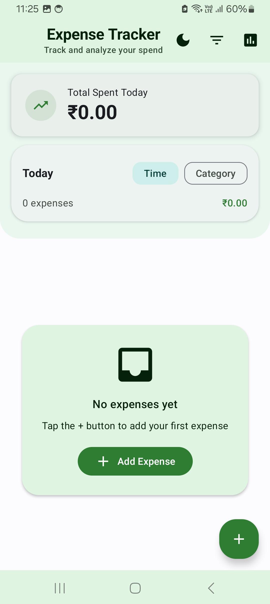

Dark:

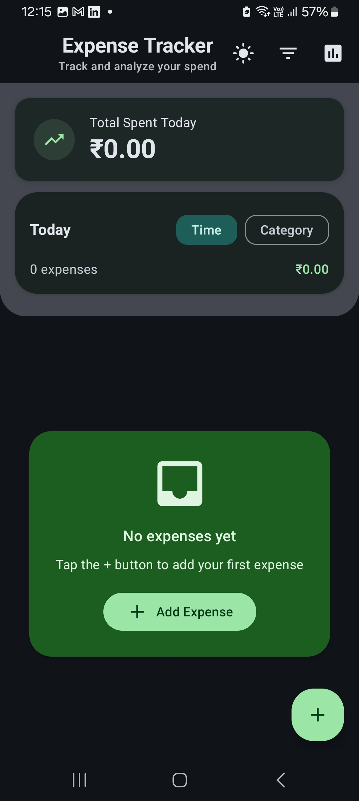

---

### 2) Category Picker (Filter Dialog)
- Description: Modern M3 dialog with icon, radio selection, scroll, Apply/Clear actions.

Light:

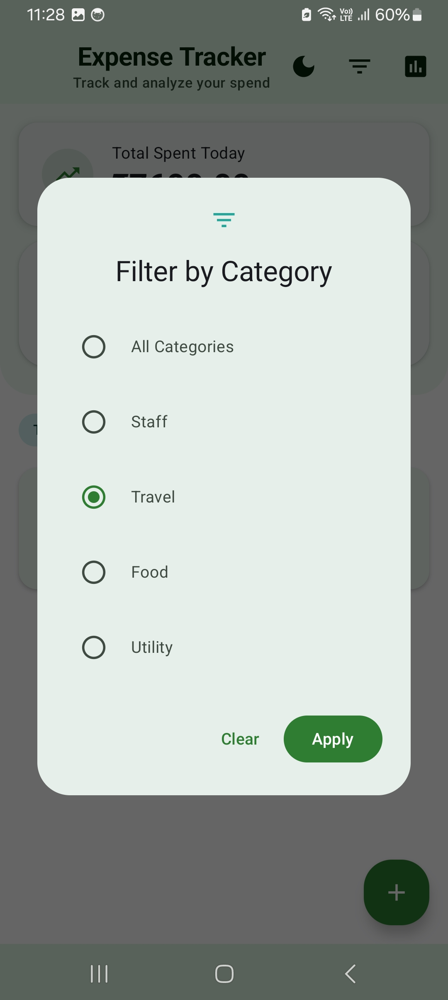

Dark:

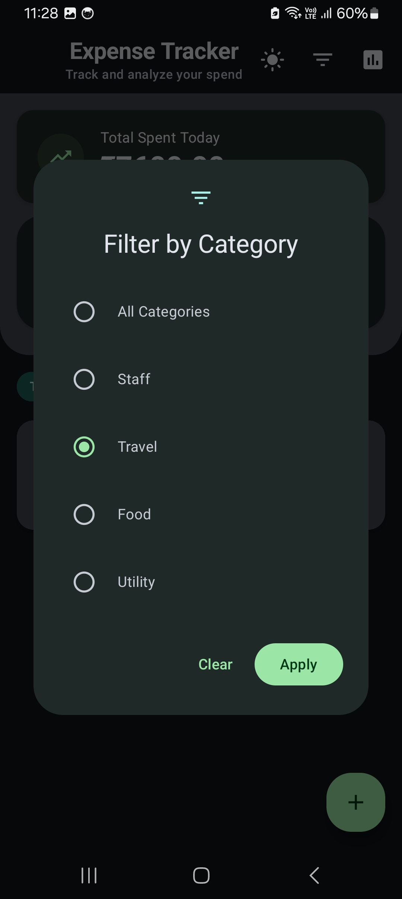

---

### 3) Filtered Expenses by Category
- Description: Expenses view filtered to a specific category with clear grouping.

Light:

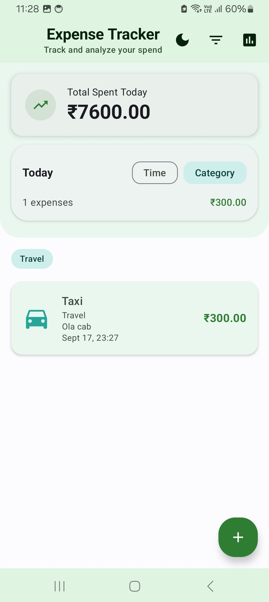

Dark:

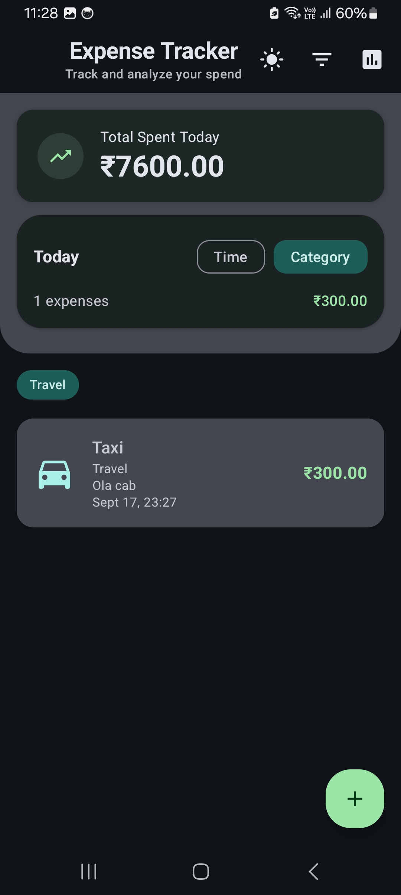

---

### 4) Reports — 7 Days Overview
- Description: Category-wise and daily trend charts with polished cards.

Light:

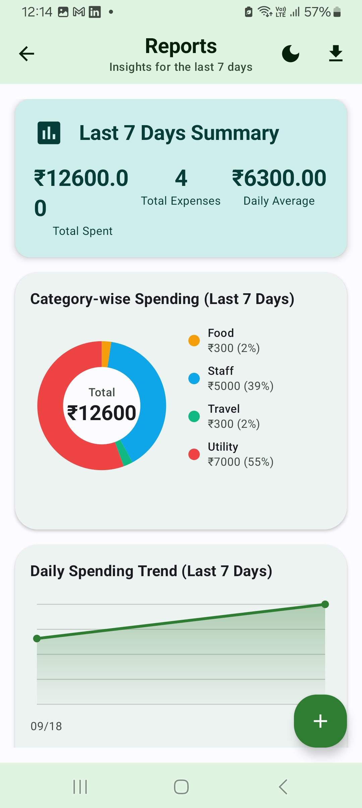

Dark:

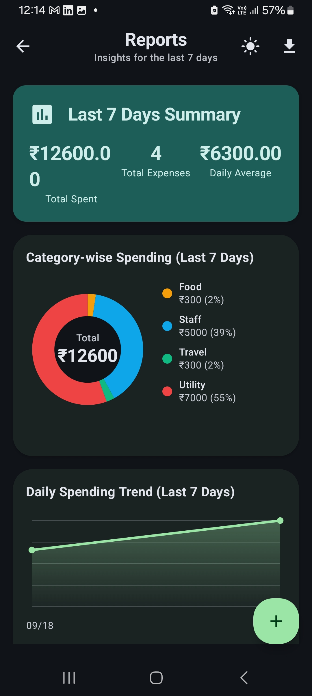

---

### 5) Today’s Expense — Category-wise Summary
- Description: Snapshot of today’s spending broken down by category.

Light:

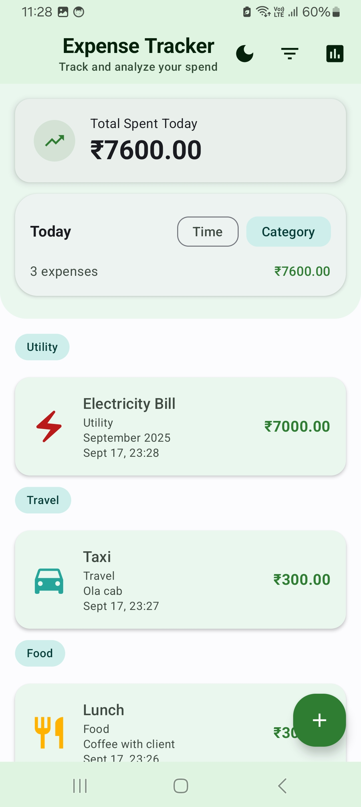

Dark:

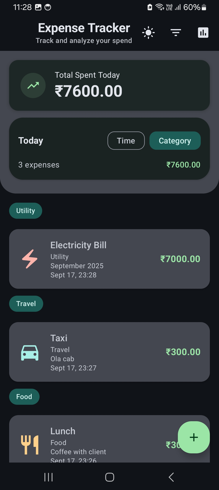

---

### 6) Export Report (Format Picker)
- Description: Export format selection dialog with radio buttons and Export/Cancel actions.

Light:

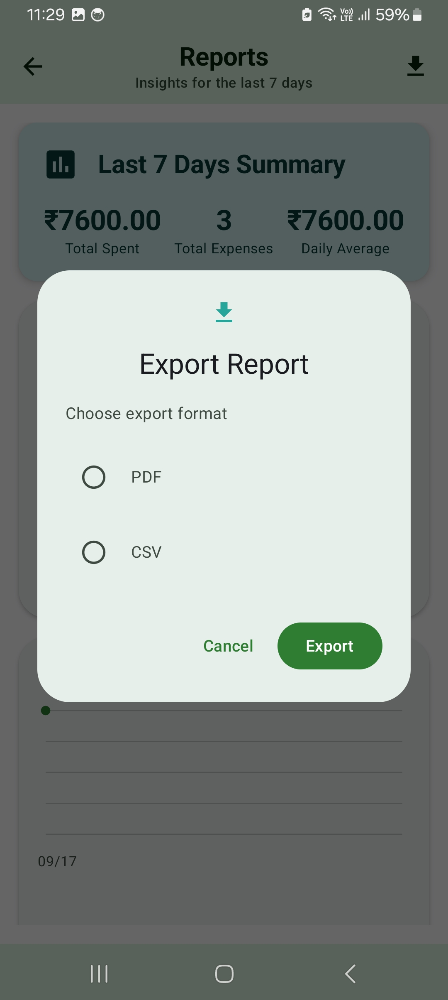

Dark:

_Not applicable_

---

**Built with ❤️ using AI-first development approach**
